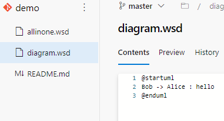
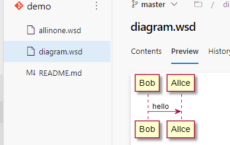

Расширение добавляет вкладку Preview для файлов с расширением .wsd в редакторе исходного кода AzureDevOps.

Рендеринг изображения UML-диаграммы происходит на внешнем сервере PlantUML. Это может быть как общедоступный сервер https://www.plantuml.com/ (by defailt), так и его onPremise версия https://hub.docker.com/r/plantuml/plantuml-server. Подключение к локальному серверу можно добавить через меню Service connection, выбрав подключение к PlantUML.

